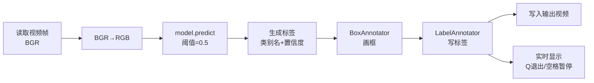

# 安全帽检测模型训练文档

基于 **RF-DETR**（Roboflow Detection Transformer）训练的安全帽佩戴检测模型，用于检测人员是否佩戴安全帽。

---

## 1. 数据集构建

### 1.1 数据来源

数据集使用 Roboflow 格式组织，包含安全帽佩戴场景的图片。

### 1.2 目录结构

```
datasets/
├── data.yaml          # 数据集配置文件
├── train/
│   ├── images/        # 230 张训练图片
│   └── labels/        # 230 个 YOLO 格式标注文件
└── valid/
    ├── images/        # 20 张验证图片
    └── labels/        # 20 个 YOLO 格式标注文件
```

### 1.3 数据集配置（data.yaml）

```yaml
train: train/images
val: valid/images

nc: 2

# Classes
names:
  0: helmet    # 佩戴安全帽
  1: not       # 未佩戴安全帽
```

### 1.4 数据统计

| 项目 | 数量 |
|---|---|
| 训练集图片 | 230 |
| 验证集图片 | 20 |
| 类别数 | 2 |
| 类别名称 | `helmet`（戴安全帽）, `not`（未戴安全帽） |
| 标注格式 | YOLO（每个 `.txt` 包含 `class_id cx cy w h` 归一化坐标） |
| 训练:验证比例 | 92:8 |

---

## 2. 模型训练

### 2.1 环境依赖

- **Python 环境**: `PyTorch` conda 环境 (`D:\miniconda3\envs\PyTorch`)
- **关键库**: `rfdetr`（包含 `[train,loggers]` 扩展）、`pytorch_lightning`、`opencv-python`（非 headless）

### 2.2 训练脚本（train.py）

```python
from rfdetr import RFDETRMedium

if __name__ == "__main__":
    model = RFDETRMedium()

    model.train(
        dataset_dir="train/helmet/datasets",
        epochs=30,
        batch_size=4,
        grad_accum_steps=4,
        lr=1e-4,
        num_workers=0,
        output_dir="train/helmet/output",
    )
```

### 2.3 超参数说明

| 参数 | 值 | 说明 |
|---|---|---|
| `dataset_dir` | `train/helmet/datasets` | 数据集根目录（相对于项目根目录） |
| `epochs` | 30 | 训练总轮数 |
| `batch_size` | 4 | 每批样本数 |
| `grad_accum_steps` | 4 | 梯度累积步数（等效 batch size = 16） |
| `lr` | 1e-4 | 学习率 |
| `num_workers` | 0 | DataLoader 工作进程数（Windows 必须设为 0 避免多进程问题） |
| `output_dir` | `train/helmet/output` | 模型和日志输出目录 |

### 2.4 模型架构

| 配置项 | 值 |
|---|---|
| 模型 | RF-DETR Medium |
| 编码器 | DINOv2 Windowed Small |
| 输入分辨率 | 576×576 |
| Patch Size | 16 |
| Decoder Layers | 4 |
| 预训练权重 | `rf-detr-medium.pth`（COCO 预训练） |
| 目标类别数 | 2（`helmet`, `not`） |
| 多尺度训练 | ✅ 启用 |
| EMA（指数移动平均） | ✅ 启用（decay=0.993） |
| 混合精度（AMP） | ✅ 启用 |

### 2.5 训练命令

```bash
cd d:/Projects/AI/RF-DETR_demo
/d/miniconda3/envs/PyTorch/python train/helmet/train.py
```

### 2.6 注意事项

> ⚠️ **Windows 平台**：必须使用 `if __name__ == "__main__":` 保护入口代码，并且 `num_workers=0`，否则 PyTorch 的 spawn 多进程机制会导致 DataLoader 崩溃。
>
> ⚠️ **OpenCV 版本**：确保安装的是 `opencv-python`（非 headless 版本），否则 GUI 显示功能不可用。如果同时存在两个版本，卸载 headless：
> ```bash
> pip uninstall opencv-python-headless -y
> pip install opencv-python --force-reinstall --no-deps
> ```

---

## 3. 训练输出结果

### 3.1 输出文件列表

```
output/
├── checkpoint_9.ckpt              # Epoch 9 定期检查点（511 MB）
├── checkpoint_19.ckpt             # Epoch 19 定期检查点（511 MB）
├── checkpoint_29.ckpt             # Epoch 29 定期检查点（511 MB）
├── last.ckpt                      # 最新检查点，用于断点续训（511 MB）
├── checkpoint_best_ema.pth        # 最佳 EMA 权重（128 MB）
├── checkpoint_best_regular.pth    # 最佳常规权重（128 MB）
├── checkpoint_best_total.pth      # 综合最优权重（128 MB）
├── metrics.csv                    # 训练指标记录（CSV）
├── events.out.tfevents.*          # TensorBoard 事件日志
├── training_config.json           # 完整训练配置快照
└── hparams.yaml                   # 超参数记录
```

### 3.2 文件说明

#### 检查点文件（`.ckpt`）

| 文件 | 用途 |
|---|---|
| `checkpoint_N.ckpt` | 每隔 10 个 epoch 保存的定期快照，保留完整训练状态 |
| `last.ckpt` | 始终指向最新 epoch，用于 `resume` 断点续训 |

> `.ckpt` 文件包含 **optimizer、scheduler、EMA 权重** 等完整训练状态，体积约 511MB，仅用于恢复训练。推理时请使用 `.pth` 文件。

#### 推理权重（`.pth`）

| 文件 | 说明 | 推荐场景 |
|---|---|---|
| `checkpoint_best_ema.pth` | 基于 EMA 权重的最优模型 | **推荐**：泛化能力通常更好 |
| `checkpoint_best_regular.pth` | 基于常规权重的最优模型 | EMA 效果不佳时备用 |
| `checkpoint_best_total.pth` | 综合考虑 val loss + mAP 的最优模型 | 通用选择 |

#### 日志文件

| 文件 | 说明 |
|---|---|
| `metrics.csv` | 每个 epoch 的训练/验证指标：loss、各类别 AP、mAP、mAR 等 |
| `events.out.tfevents.*` | TensorBoard 日志，可用 `tensorboard --logdir output/` 可视化 |
| `training_config.json` | 训练时使用的完整配置，包含模型架构、超参数、数据路径等 |

### 3.3 训练结果指标

训练 30 个 epoch（最终 epoch = 29）：

| 指标 | 最优值 | 对应 Epoch |
|---|---|---|
| **helmet AP** | **75.8%** | Epoch 10 |
| **not AP** | **62.8%** | Epoch 28 |
| **mAP@50** | 99.2% | Epoch 28 |
| **mAP@50-95** | **60.5%** | Epoch 4 |
| **最佳 val loss** | 3.74 | Epoch 29 |

> `not`（未戴安全帽）类别的 AP 较 `helmet` 低约 13%，可能原因是负样本数量较少或场景多样性不足，后续可通过增加负样本、数据增强等方式优化。

### 3.4 训练过程可视化

```bash
# 启动 TensorBoard 查看训练曲线
tensorboard --logdir train/helmet/output/
```

loss 和 mAP 变化趋势可通过 `metrics.csv` 或 TensorBoard 查看。训练过程中 val loss 从 ~18.9 持续下降至 ~3.74，模型收敛良好。

---

## 4. 模型测试

### 4.1 测试脚本（test.py）

测试脚本使用训练好的模型对视频进行推理，实时显示检测结果并保存输出视频。

```python
import cv2
import supervision as sv
from rfdetr import RFDETRMedium

# 配置
INPUT_VIDEO = "helmet.mp4"
OUTPUT_VIDEO = "helmet_output.mp4"
CONFIDENCE_THRESHOLD = 0.5
MODEL_PATH = "output/checkpoint_best_total.pth"
CLASS_NAMES = ["helmet", "not"]

# 加载模型（num_classes=2 与训练时一致）
model = RFDETRMedium(pretrain_weights=MODEL_PATH, num_classes=2)

# 初始化 supervision 标注器
box_annotator = sv.BoxAnnotator()
label_annotator = sv.LabelAnnotator()
```

### 4.2 推理流程



### 4.3 关键实现细节

| 步骤 | 说明 |
|---|---|
| 颜色空间 | 推理前 `BGR → RGB`；标注时使用原始 BGR（OpenCV 写入需要） |
| 模型加载 | `num_classes=2` 避免与默认 90 类不匹配的警告 |
| 标注 | `sv.BoxAnnotator` 画检测框，`sv.LabelAnnotator` 显示类别名和置信度 |
| 交互 | 按 **Q** 退出，按 **空格** 暂停/继续 |

### 4.4 运行测试

```bash
cd d:/Projects/AI/RF-DETR_demo/train/helmet
/d/miniconda3/envs/PyTorch/python test.py
```

### 4.5 单张图片测试

除了视频，也可以用静态图片快速验证模型效果：

```bash
# 测试图片位于 train/helmet/ 目录
/d/miniconda3/envs/PyTorch/python -c "
import cv2
import supervision as sv
from rfdetr import RFDETRMedium

model = RFDETRMedium(pretrain_weights='output/checkpoint_best_total.pth', num_classes=2)
CLASS_NAMES = ['helmet', 'not']

image = cv2.imread('test_helmet.jpg')
image_rgb = cv2.cvtColor(image, cv2.COLOR_BGR2RGB)
detections = model.predict(image_rgb, threshold=0.5)

labels = [f'{CLASS_NAMES[cid]} {conf:.2f}' for cid, conf in zip(detections.class_id, detections.confidence)]
annotated = sv.BoxAnnotator().annotate(image, detections)
annotated = sv.LabelAnnotator().annotate(annotated, detections, labels)

cv2.imwrite('test_result.jpg', annotated)
print('结果已保存到 test_result.jpg')
"
```

---

## 5. 常见问题

### Q1: 训练时出现 `RuntimeError: Please call iter(combined_loader) first`

这是 Windows 多进程问题的**次级错误**，真正原因是缺少 `if __name__ == "__main__":` 保护。在 `train.py` 中将训练代码放入该保护块，并设置 `num_workers=0`。

### Q2: 测试时 `cv2.error: The function is not implemented`

OpenCV 安装了 headless 版本，GUI 功能不可用。卸载 headless 版本并安装完整版：

```bash
pip uninstall opencv-python-headless -y
pip install opencv-python --force-reinstall --no-deps
```

### Q3: 模型加载时出现 class 数量警告

```
Checkpoint has 2 classes but model is configured for 90.
```

在 `RFDETRMedium()` 初始化时传入 `num_classes=2` 参数即可消除。

### Q4: `not` 类别检测效果不好

- 检查训练集中 `not` 类别的样本数量和标注质量
- 考虑增加数据增强或收集更多负样本
- 可尝试调整 `CONFIDENCE_THRESHOLD` 阈值

---

## 6. 文件索引

| 文件 | 用途 |
|---|---|
| `train.py` | 模型训练脚本 |
| `test.py` | 视频推理测试脚本 |
| `datasets/` | 训练和验证数据集 |
| `output/` | 训练输出（模型权重 + 日志） |
| `helmet.mp4` | 测试视频 |
| `test_helmet.jpg` | 正样本测试图片（戴安全帽） |
| `test_not.jpg` | 负样本测试图片（未戴安全帽） |
| `helmet_output.mp4` | 推理输出视频（运行 test.py 生成） |
